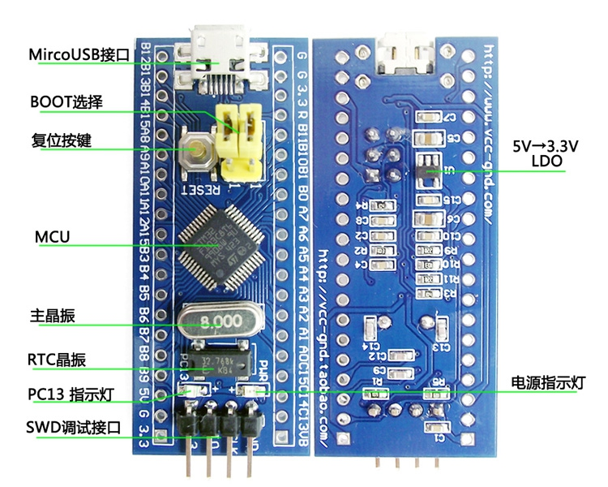
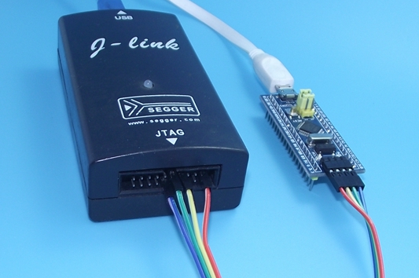

## Hardware

## Burn

### JLinkExe
Download jlink from https://www.segger.com/jlink-software.html

    $ dpkg -i jlink_4.96.7_x86_64.deb
    $ JLinkExe
    J-Link>exec device=STM32F103C8
    J-Link>loadbin main.bin,0x8000000

Press reset button to run

### OpenOCD
OpenOCD is also supported, Google it.
